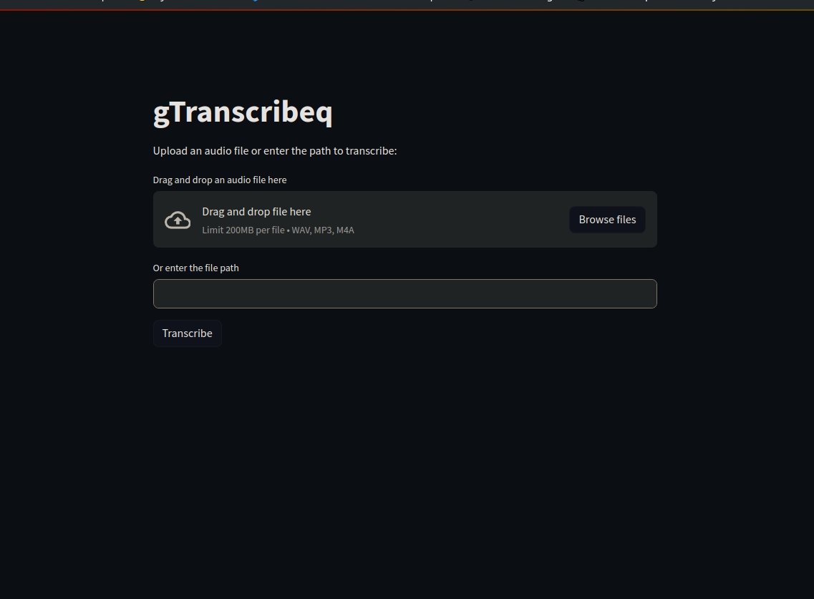

# Real-Time Translation Tool with Groq

## Description
This release (v2.1 "Thunder+") of our Real-Time Translation Tool introduces lightning-fast transcription capabilities powered by Groq's API, while maintaining OpenAI's robust translation and text-to-speech features. This update significantly enhances performance and expands the tool's capabilities for global communication and language learning.

## Release Notes for v2.1 "Thunder+" ⚡🚀
### New Features 🌟
- **gTranscribeq Web App**: Introduced a Streamlit-based web application for easy audio transcription using Groq's API.
- **Groq API Integration**: Leveraging Groq's high-speed API for **ultra-fast transcription**, dramatically reducing processing time.
- **Dynamic Content Handling**: Implemented a new system for **customizing content based on selected languages**, enhancing translation accuracy and context.
- **Expanded Language Support**: Added support for multiple Spanish dialects and other languages, providing more **nuanced and region-specific translations**.
- **Smart Select Option**: Introduced a "Smart Select" feature for **automatic language detection and multilingual translation**.

### Improvements 💡
- **Refactored Main Function**: Streamlined the main function for better handling of command-line arguments and improved flow control.
- **Enhanced Error Handling**: Implemented more robust error handling, especially for API interactions and file operations.
- **Optimized Performance**: Fine-tuned the application for faster response times and improved resource utilization.
- **User Experience Enhancements**: Refined user prompts and interaction flows for a more intuitive experience.

### Installation & Setup
Ensure you have Python 3.x and necessary libraries installed, along with ffmpeg for audio processing.

- It also requires the command-line tool ffmpeg to be installed on your system, which is available from most package managers:
```
# on Ubuntu or Debian
sudo apt update && sudo apt install ffmpeg

# on Arch Linux
sudo pacman -S ffmpeg

# on MacOS using Homebrew (https://brew.sh/)
brew install ffmpeg

# on Windows using Chocolatey (https://chocolatey.org/)
choco install ffmpeg

# on Windows using Scoop (https://scoop.sh/)
scoop install ffmpeg
```

### Steps
1. Clone the repository: `git clone https://github.com/yourusername/liveTranslation_openai-whisper.git`
2. Navigate to the cloned directory: `cd liveTranslation_openai-whisper`
3. Install required libraries: `pip install -r requirements.txt`

## Configuration
Set up your API keys in `config.yaml`:
1. Rename `config.yaml.default` to `config.yaml`
2. Enter your API keys in the `config.yaml` file:
```yaml
openai:
  api_key: "Your-OpenAI-API-Key"
groq:
  api_key: "Your-Groq-API-Key"
```

## Command-Line Interface (main.py)
Execute with `python main.py` and the following optional flags:
- `-d <seconds>`: Set the duration for audio capture.
- `-f <filename.wav>`: Translate from an existing audio file.
- `-c <language>`: Choose a specific language or use `Smart Select` for automatic detection.
- `-t`: Enable continuous translation mode. (No Spacebar toggle record)
- `-v <voice_name>`: Activate text-to-speech for the translated text.

### Usage Examples

- 4-second live translation in European Spanish with toggle recording
  
`python main.py -d 4 -c "European Spanish (Spain)"`

---

- 10-second live translation in continuous mode with Smart Select

`python main.py -d 10 -t -c "Smart Select"`

---

- Translate an existing audio file with Shimmer's voice
  
`python main.py -f audioFileName.wav -v shimmer`

---

- Mandarin Chinese translation with Nova voice, 8-second recording in continuous mode
  
`python main.py -c "Mandarin Chinese" -v nova -d 8 -t`

---


## Web Application (gTranscribeq)
gTranscribeq is a Streamlit-based web application that provides an easy-to-use interface for audio transcription using Groq's API.


### Features
- Drag-and-drop or file upload functionality for audio files
- Support for WAV, MP3, and M4A audio formats
- Automatic transcription using Groq's high-speed API
- Display of transcription results with download option

### Running gTranscribeq
To run the gTranscribeq web application:

1. Ensure you have installed all requirements: `pip install -r requirements.txt`
2. Run the Streamlit app: `streamlit run gTranscribeq.py`
3. Open your web browser and navigate to the URL provided by Streamlit (usually `http://localhost:8501`)

Use the web interface to upload your audio file and receive the transcription quickly and easily.

## Troubleshooting
If you encounter issues, check your microphone settings and ensure both the OpenAI and Groq API keys are valid and properly configured in the `config.yaml` file.

## Contributing
Contributions are welcome. Fork the repository and submit a pull request with your changes.

## License
This project is licensed under the MIT License - see the [LICENSE](LICENSE) file for details.

## Contact
For more information, contact me at [willTheNightFox@gmail.com](mailto:willTheNightFox@gmail.com).

## Acknowledgments
Special thanks to the OpenAI team for the GPT-4 model and text-to-speech capabilities, and to Groq for their lightning-fast transcription API.

## Feedback and Feature Requests
Your feedback is invaluable to us. If you have any suggestions or would like to request new features, please feel free to open an issue on GitHub or submit a pull request. We're always looking to improve and your contributions are greatly appreciated!

---
